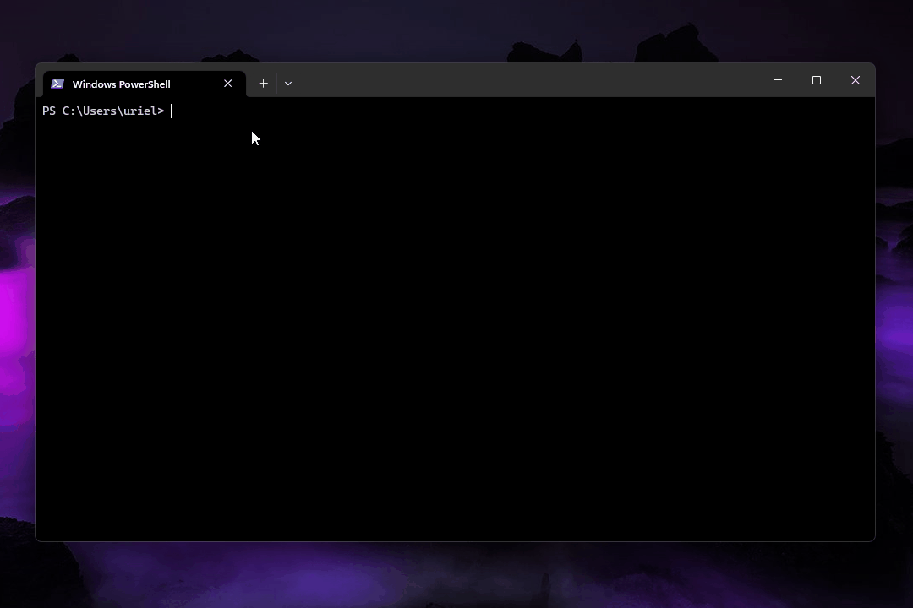

# Todo - CLI Rust Program

A simple command-line todo list written in Rust.



## Usage

```bash
todo <COMMAND> [ARGUMENTS]
```

For example `todo` will print the welcome and help messages.

### add

Add new task/s to the list. Alternatives: **"new"**, **"post"**.  
`todo add [string/string array]`

```
> todo add

Enter your new task:
Some task
Task/s added successfully:
 > Some task
```

```
> todo add "adding one task"

Task/s added successfully:
 > adding one task
```

```
> todo add Adding "Multiple tasks" example

Task/s added successfully:
 > Adding
 > Multiple tasks
 > example
```

### remove

Remove task/s from list. Alternatives: **"remove"**, **"rm"**, **"delete"**, **"del"**.  
`todo remove [numbers/otions]`
- Options: 
	- **all**: Remove all tasks (Alternatives: **"."**, **"\*"**, **"--all"**). `todo remove --all`
	- **--last**: Remove last task. `todo remove --last`

```
> todo remove

Enter the number of task to remove:
7
Task 7 removed successfully
```

```
> todo rm 6

Task/s removed successfully:
 > 6
```

```
> todo del 6 4 5

Task/s removed successfully:
 > 6
 > 5
 > 4
```

### done / undone / pending

Mark task/s as "done", "undone" or "pending".  
Each command works similarly "done", "undone" and "pending", but each one marks its respective state.  
`todo done [numbers/otions]`
- Options: 
	- **all**: Mark all tasks (Alternatives: **"."**, **"\*"**, **"--all"**). `todo done --all`
	- **--last**: Mark last task. `todo done --last`

```
> todo done

Enter the number of task to mark as done:
5
Task 5 marked as 'done' successfully
```

```
> todo undone 6 4

Task/s marked as 'done' successfully:
 > 6
 > 4
```

```
> todo pending --all

All tasks have been marked as 'Done'
```

### get

Print a specific task/s. Alternative: **"task"**, **"get"**, **"print"**.  
`todo get [numbers]`

```
> todo get

Enter the number of task you want:
2
Task found successfully:
2. [ ➖ ] - example
```

```
> todo get 2

Task/s found successfully:
2. [ ➖ ] - example
```

### list

Print the todo list. `list sort` sort tasks by status. Alternative: **"ls"**.  
`todo list [otions]`
- Options: 
	- **(No option)**: List all tasks. `todo list`
	- **all**: List all tasks (Alternatives: **"."**, **"\*"**, **"--all"**). `todo list all`
	- **done**: List only "done" tasks. `todo list done`
	- **undone**: List only "undone" tasks. `todo list undone`
	- **pending**: List only "pending" tasks. `todo list pending`
	- **categorized**: List tasks sorted by status. `todo list categorized`
	- **sort**: Sort todo list by status  (Alternatives: **"order"**). `todo list sort

```
> todo list

0. [ ✔️ ] - Adding
1. [ ✖️ ] - Multiple tasks
2. [ ➖ ] - example
3. [ ✔️ ] - Adding
4. [ ✖️ ] - Multiple tasks
5. [ ➖ ] - example
```

```
> todo list categorized

"DONE" TASKS:
0. [ ✔️ ] - Adding
3. [ ✔️ ] - Adding
"UNDONE" TASKS:
1. [ ✖️ ] - Multiple tasks
4. [ ✖️ ] - Multiple tasks
"PENDING" TASKS:
2. [ ➖ ] - example
5. [ ➖ ] - example
```

```
> todo list sort

New ordered list:
0. [ ✖️ ] - Multiple tasks
1. [ ✖️ ] - Multiple tasks
2. [ ➖ ] - example
3. [ ➖ ] - example
4. [ ✔️ ] - Adding
5. [ ✔️ ] - Adding
```

### edit

Allows to edit a task. Alternative: **"update"**.  
`todo edit [number] [string]`

```
> todo edit

Enter the number of task you want to edit:
2
Task found successfully.Enter new task content:
Some change
Task/s edited successfully:
2. [ ➖ ] - Some change
```

```
> todo edit 2

Task found successfully.Enter new task content:
Some change
Task/s edited successfully:
2. [ ➖ ] - Some change
```

```
> todo edit 2 "Some change"

Task/s edited successfully:
2. [ ➖ ] - Some change
```

### help

Print a list of commands. Alternatives: "-h", "--help".  
`todo help`

### version

Print a list of commands. Alternatives: "-v", "--version".  
`todo version`

```
> todo version

todo cli version: 2.0.1
```

### doc

Open documentation on default browser. Alternatives: **"web"**, **"documentation"**, **"url"**, **"open_url"**.  
`todo doc`

```
> todo version

todo cli version: 2.2.0
```
